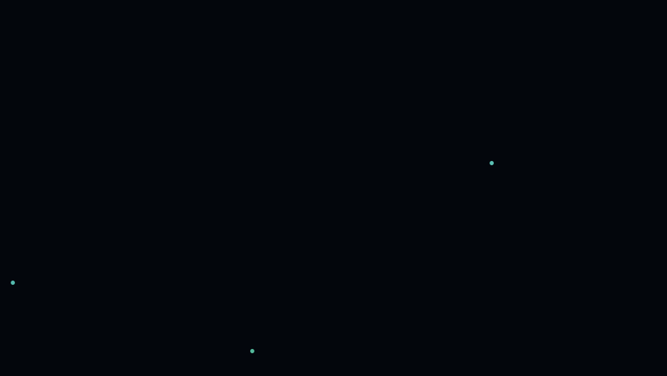

# driftlight

A calming terminal screensaver. Think `cmatrix`, but the opposite feeling.

Turn your terminal into night water, a living contour map, silk currents, or
a tiny orbital sculpture. Six scenes share the same idea: slow motion, soft
light, room to look away. Built to be watched, or half-watched, while you breathe.



Pure Python 3 standard library. No dependencies. One file. MIT licensed.

## Install

```sh
git clone https://github.com/YOU/driftlight.git
cd driftlight
./install.sh          # copies to ~/.local/bin/driftlight
```

Or just run it in place:

```sh
./driftlight
```

## Controls

driftlight is interactive while it runs:

| key | action |
|-----|--------|
| `h` | toggle the help panel |
| `s` | open the settings panel at any time — change palette, density, breath, etc. **live** |
| `q` / `Ctrl-C` | quit |
| `esc` | close an open panel (or quit if none is open) |
| `space` | drop a pebble while watching `ripple` (in Settings, select/cycle) |

In the settings panel:

| key | action |
|-----|--------|
| `↑` / `↓` or `k` / `j` | choose a setting |
| `←` / `→` or `-` / `+` | change the selected value |
| `Enter` or `space` | select / cycle the highlighted value |
| `Esc` | leave the settings menu |

The scene and appearance settings can be changed live from the `s` panel without restarting —
handy for finding the density and palette that feel right for your terminal.
Pick a palette as a starting point, then fine-tune with the **Hue**,
**Saturation**, **Brightness**, and **Glow** sliders to land on your exact color.

## Styles

| style | feeling / motion |
|-------|------------------|
| `plankton` | Original night sea: sparse glowing motes wake in invisible currents. |
| `breathcore` | A luminous central ring gathers and releases motes; breath-sync gives it an inhale and exhale. |
| `contour` | An imaginary topographic map slowly changes elevation. Fine contour lines form islands and valleys. Artsy survey-instrument energy. |
| `ribbons` | Long, softly lit silk filaments fold across the screen. A little aurora, a little underwater fabric. |
| `orrery` | A suspended orbital sculpture: tilted paths, small satellites, faint wakes, a quiet central sun. |
| `ripple` | Sparse, overlapping water rings appear and dissolve. Press **Space** to drop another pebble at a new spot. |

Start with `s` → **Style** → `←` / `→` to preview each scene. The name and
description update immediately; `Enter` also advances. `Esc` gets you back to
the scene. Changes are for the current run; use flags for a repeatable favorite.

```sh
driftlight --style breathcore --breath 4-7-8 --palette teal
driftlight --style contour --palette ice --density 0.7
driftlight --style ribbons --palette violet --breath box
driftlight --style orrery --palette ember --density 0.6
driftlight --style ripple --palette teal --linger 5
```

**Density** means activity/detail: motes, contour spacing, ribbon count, orbit
count, or automatic pebble frequency. **Linger** changes plankton fading and
ripple lifetime; **Shimmer** is specific to plankton. All styles use palette,
hue, saturation, brightness, glow, breath brightness, and circadian tint.
Glow lifts faint marks; it does not blur the terminal. Weather varies plankton
blooms and the four new scenes' light; breathcore follows its breath instead.
Sleep dims every scene and gradually slows the four new scenes. No sound,
mouse, networking, or extra packages are needed.

## Why it's calm (and cmatrix isn't)

`cmatrix` is fast, high-contrast, and reads as *urgent*. driftlight inverts all
three: motion is slow, contrast is low (dim pastels, not neon), and events are
irregular and organic instead of rigid falling columns. The magic is in the
timing, not the shape — nothing ever *arrives* or *ends*, it just breathes.

## The premium touches

Everything below is optional and composable.

### Breath-sync
The entire scene brightens on the inhale, holds, and dims on the exhale — and
plankton bloom faster on the inhale. Follow the rhythm if it feels comfortable,
or leave breath-sync off and just watch. A faint indicator shows the phase.

```sh
driftlight --breath 4-7-8      # relaxing 4-7-8 breathing
driftlight --breath box        # 4-4-4-4 box breathing
driftlight --breath 5-5-5      # custom inhale-hold-exhale
driftlight --breath 4-4-6-2    # custom inhale-hold-exhale-hold
```

### Circadian palette drift  (on by default)
driftlight reads your system clock. After sunset the palette warms toward amber
and dims ~15%; deep night gets darker still; morning cools back to cyan. It
uses a simple time-of-day color curve, not a sleep or medical measurement.
Turn it off with `--no-circadian`.

### Long-arc weather  (on by default)
A hidden meta-state on an ~8-minute cycle slowly modulates how much plankton
bloom, so it never loops into the pattern-fatigue that makes people quit
`cmatrix` after 90 seconds. Tune the cycle with `--weather 12`, or `--weather 0`
to disable.

### Sleep wind-down
A slow ramp to near-stillness over N minutes — a wind-down for the end of the
day. Start it and go to sleep.

```sh
driftlight --sleep 30
```

## Options

| flag | default | what it does |
|------|---------|--------------|
| `--style NAME` | `plankton` | `plankton`, `breathcore`, `contour`, `ribbons`, `orrery`, `ripple` |
| `--palette NAME` | `teal` | starting color: `teal`, `ice`, `aurora`, `ember`, `mono`, `violet` |
| `--hue DEG` | `0` | rotate the palette hue, -180..180° |
| `--saturation N` | `1.0` | color saturation multiplier, 0..1.5 (lower = washed out) |
| `--brightness N` | `1.0` | overall brightness gain, 0.3..1.8 |
| `--glow N` | `0.5` | lift faint marks, 0..1 |
| `--density N` | `1.0` | scene activity/detail (0.2 sparse .. 2.0 dense) |
| `--linger SEC` | `3.2` | plankton fade time; also extends ripple lifetime |
| `--fps N` | `22` | frames per second |
| `--breath SPEC` | `off` | `off`, `4-7-8`, `box`, or `a-b-c` / `a-b-c-d` |
| `--sleep MIN` | off | wind down to stillness over MIN minutes |
| `--weather MIN` | `8` | long-arc bloom/calm cycle length (0 = off) |
| `--no-circadian` | | disable warm+dim drift after sunset |
| `--no-shimmer` | | disable the diagonal shimmer sweeps |
| `--no-indicator` | | hide the breath indicator |
| `--seed N` | | reproducible randomness |
| `--256` / `--truecolor` | auto | force color depth (auto-detects `COLORTERM`) |

## A few nice recipes

```sh
driftlight                                   # gentle defaults
driftlight --palette violet --density 0.6    # sparse deep-sea purple
driftlight --breath 4-7-8 --palette ice      # cold, meditative, breathing
driftlight --palette ember --density 1.4     # warm firefly swarm
driftlight --sleep 45 --breath box           # bedtime
driftlight --style contour --palette mono --brightness 0.7  # quiet cartography
driftlight --style ribbons --palette aurora --density 0.5  # a few silk currents
driftlight --style orrery --palette ice --breath 5-5-5      # slow observatory
driftlight --style ripple --palette violet --sleep 20      # pebble pond
```

## Development checks

```sh
python3 -m unittest discover -s tests -v
./driftlight --style ribbons --frames 2 --no-altscreen > /dev/null
```

The tests exercise all six styles, repeatable seeded rendering, live Settings
switching, clearing closed panels, small terminal bounds, and pebble input.

## Requirements

- Python 3.6+
- A terminal with 256-color or truecolor support (basically all of them). Set
  `COLORTERM=truecolor` if your terminal supports 24-bit color but doesn't
  advertise it.

## License

MIT — see [LICENSE](LICENSE).
